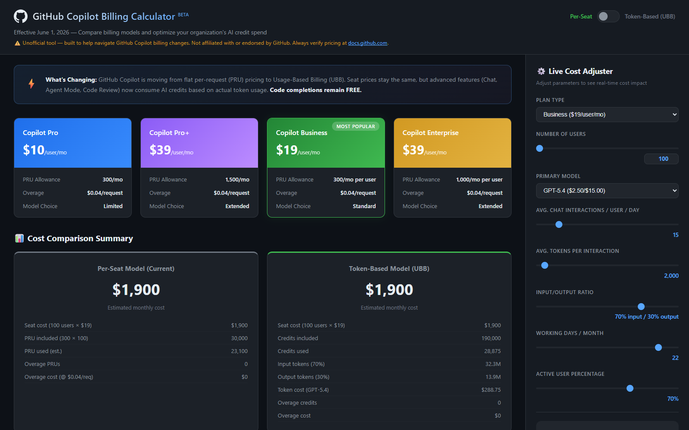
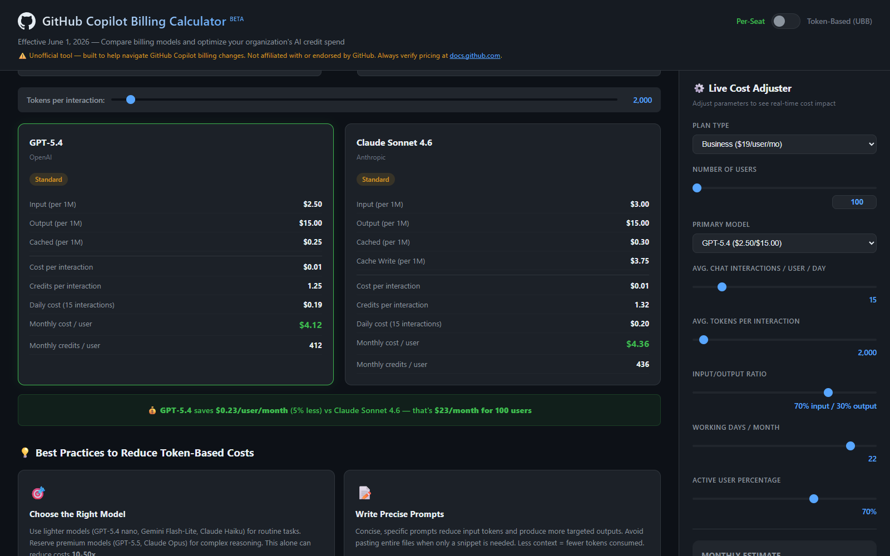
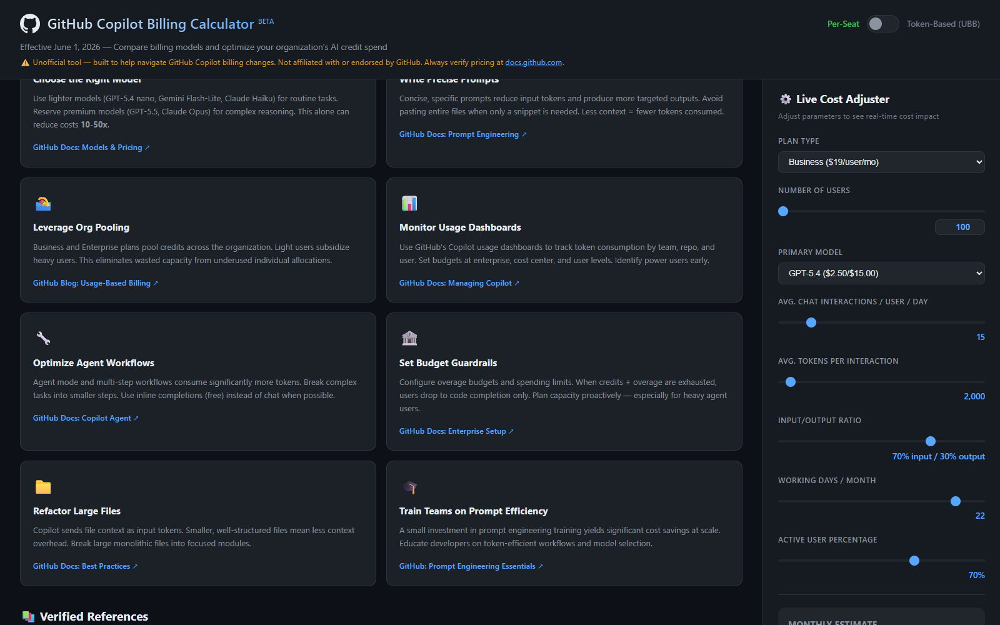

# GitHub Copilot Usage-Based Billing (UBB) Calculator

A zero-dependency, single-page web application that helps organizations understand, compare, and optimize GitHub Copilot costs as billing transitions from per-seat (PRU) to Usage-Based Billing (UBB) on June 1, 2026.

> **Live demo:** [Open the GitHub Copilot Billing Calculator](https://ab3y.github.io/GHCPTBB/)


## Screenshots

### Billing Dashboard and Live Cost Adjuster



### Model Cost Comparison



### Cost Optimization Best Practices



---

## 🎯 Purpose

GitHub Copilot is moving from flat per-request (PRU) pricing to Usage-Based Billing. This tool helps:

- **Engineering Leaders** — Model the cost impact of UBB on their org before June 1
- **FinOps Teams** — Forecast monthly spend under different usage scenarios
- **Platform Engineers** — Choose optimal AI models to balance capability vs. cost
- **Account Teams** — Run proactive "token impact conversations" with customers

## ✨ Features

### Billing Comparison Dashboard
- **Toggle view** between per-seat (PRU) and token-based (UBB) pricing
- Side-by-side plan comparison cards for Pro, Pro+, Business, and Enterprise
- Visual cost comparison with savings/overspend indicators

### Live Cost Adjuster (Side Panel)
Real-time scenario modeling with adjustable parameters:
- Plan type selection
- Number of users (1–50,000)
- Primary AI model (12 models across GPT, Claude, Gemini)
- Average chat interactions per user per day
- Tokens per interaction
- Input/output token ratio
- Working days per month
- Active user percentage

### Model Pricing Reference
Complete pricing table for all 12 supported models:
- **OpenAI**: GPT-5.4 nano/mini/standard, GPT-5.5, GPT-5.2 Codex, GPT-4.1
- **Anthropic**: Claude Haiku 4.5, Claude Sonnet 4.6, Claude Opus 4.7
- **Google**: Gemini 2.5 Flash-Lite/Flash, Gemini 3.1 Pro

### Best Practice Insights
8 actionable strategies to reduce token consumption, each with verified references:
1. Choose the right model for the task
2. Write precise prompts
3. Leverage org credit pooling
4. Monitor usage dashboards
5. Optimize agent workflows
6. Set budget guardrails
7. Refactor large files
8. Train teams on prompt efficiency

### Verified References
All pricing data and recommendations link to official sources:
- GitHub Blog official announcements
- GitHub Docs pricing and management pages
- Industry analysis from ZDNET, The New Stack

## 📖 Complete UBB Education Guide

For a comprehensive deep-dive into everything about Usage-Based Billing — including how credits work, model pricing tables, pooling mechanics, budget controls, best practices, competitive context, FAQ, and 30+ verified official references — see:

👉 **[UBB-GUIDE.md](UBB-GUIDE.md)** — The complete GitHub Copilot Usage-Based Billing guide

---

## 🚀 Getting Started

### Prerequisites
- Any modern web browser (Chrome, Firefox, Edge, Safari)
- No build tools, package managers, or servers required

### Quick Start

```bash
# Clone or download the project
cd GHCPTBB

# Option 1: Open directly in browser
start index.html          # Windows
open index.html           # macOS
xdg-open index.html       # Linux

# Option 2: Serve with any HTTP server
npx serve .               # Node.js
python -m http.server 8080  # Python
```

### Project Structure

```
GHCPTBB/
├── index.html      # Main page structure and layout
├── styles.css      # Complete styling (dark theme, responsive)
├── app.js          # Calculator engine, toggle logic, live updates
├── docs/
│   └── screenshots/ # README screenshots
├── UBB-GUIDE.md    # Complete UBB education guide (27K words, 30+ refs)
└── README.md       # This file
```

## 🏗️ Architecture

### Zero Dependencies
The entire application is built with vanilla HTML, CSS, and JavaScript. No frameworks, no build step, no npm packages. This makes it:
- **Instantly deployable** — drop files on any web server
- **Offline capable** — works without internet (except external reference links)
- **Easy to customize** — single-file CSS theme, straightforward JS logic

### Data Model
All pricing data is embedded in `app.js` as structured constants:
- `MODEL_PRICING` — Token rates per model (input/output/cached per 1M tokens)
- `PLAN_CONFIG` — Plan pricing, credit allowances, and promo periods
- Calculator functions compute costs in real-time as users adjust parameters

### Responsive Design
- **Desktop** (1400px+): Full dashboard with side panel
- **Tablet** (768–1400px): Stacked layout, 2-column cards
- **Mobile** (<768px): Single column, panel below main content

## 📊 Key Billing Data (as of April 2026)

| Plan | Price | AI Credits/mo | Promo Credits (3 mo) |
|------|-------|---------------|---------------------|
| Pro | $10/user | 1,000 | — |
| Pro+ | $39/user | 3,900 | — |
| Business | $19/user | 1,900 | 3,000 |
| Enterprise | $39/user | 3,900 | 7,000 |

**Key rules:**
- 1 AI credit = $0.01 USD
- Code completions remain **FREE** (no credits consumed)
- Credits are **pooled** at org level for Business/Enterprise
- When credits exhausted → code completion only (until refill or next month)

## 🔗 References

- [GitHub Blog: Moving to Usage-Based Billing](https://github.blog/news-insights/company-news/github-copilot-is-moving-to-usage-based-billing/)
- [GitHub Docs: Models and Pricing](https://docs.github.com/en/copilot/reference/copilot-billing/models-and-pricing)
- [GitHub Docs: Managing Copilot for Enterprise](https://docs.github.com/en/copilot/managing-copilot/managing-copilot-for-your-enterprise/managing-the-copilot-plan-for-your-enterprise)
- [GitHub Docs: Prompt Engineering](https://docs.github.com/en/copilot/using-github-copilot/prompt-engineering-for-github-copilot)

## 📝 License

MIT — Use freely for internal or customer-facing readiness.

## ⚠️ Disclaimer

Pricing data is sourced from publicly available GitHub documentation and blog posts as of April 2026. All cost estimates are approximate. Actual costs will vary based on usage patterns, model selection, caching efficiency, and GitHub pricing updates. Always verify current pricing at [docs.github.com](https://docs.github.com/en/copilot/reference/copilot-billing/models-and-pricing).
